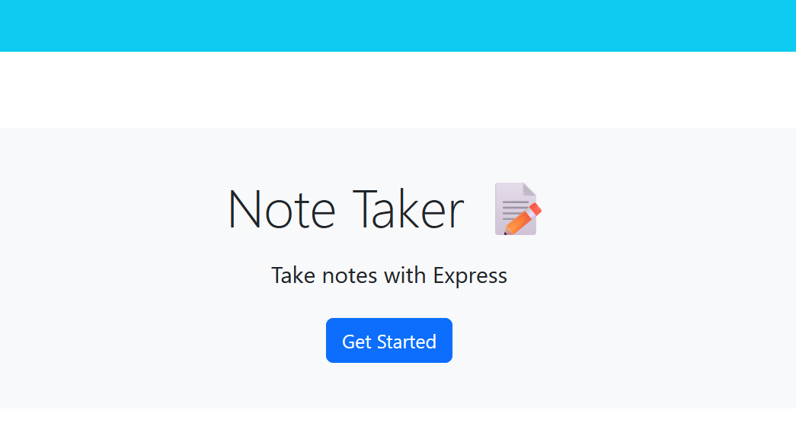

# Mini-Notetaker by Alan Lee

## Table of Contents

[Description](#description)

[Installation](#installation)

[Usage Information](#usage-information)

[Testing Instructions](#testing-instructions)

[Deployed Website](#deployed-website)

[Questions?](#questions?)

[Contributing](#contributing)

[License](#license)

## Description 
This project is an app that connects a user to a heroku server and database that will allow the user to store their notes online and access them! The main body of this code comes from the UW-EDX Bootcamp. This includes the front-end application and all relavent JS and HTML files. Most of the Javascript also comes from the bootcamp including the basic setup of a modular server. Ultimately, the only aspects of the code presented here that are uniquely mine are around the connection between the various endpoints to the front-end application. But I want to stress that around 90-95% of the js code proper came from the bootcamp.

## Installation
N/A

## Usage Information
A user may use this application however they wish! If they decide to take any code from it they should reference and link back to the UW-EDX bootcamp.

## Testing Instructions
N/A

## Deployed Website 
Link to Alan Lee's Mini-Notetaker: https://dashboard.heroku.com/apps/mini-eureka-21-app

Link to Deployed Application: https://mini-eureka-21-app-2788c8a726d6.herokuapp.com/ 

Link to Alan Leet's GitHub on Mini-Notetaker: https://github.com/DimtheQuiet21/mini-erureka

Link to VIDEO of Alan Lee's Mini-Notetaker: https://www.youtube.com/watch?v=nwuIOqCLhJQ 

## Questions?
Please Contact Alan Lee at aflee227@gmail.com if you have additional questions.

## Contributing 
There are no contribution guidelines

## License 
The MIT was used for the creation and the publication of this Repository and Webpage.
